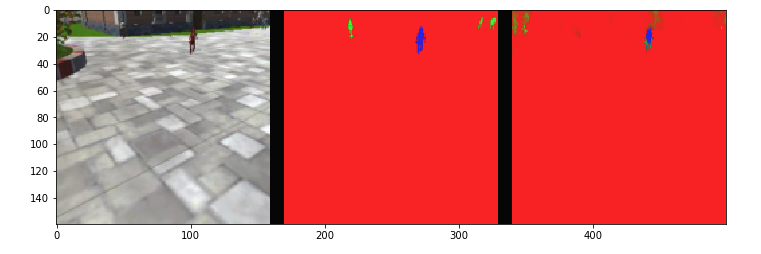

## Project: Follow Me

---

The goal of this project is to provide an ability for a QuadRotor drone to track and follow a moving target. By analyzing individual frames from a forward-facing camera on a drone and leveraging semantic segmentation, we set out to train a fully connected network (FCN) that would allow us to meet this goal.

### The Environment setup

This project can be done either on a local machine or using a solution such as Amazon Web Services (AWS).
In my case, the model was trained on AWS EC2 p2.xlarge instance, using Amazon Machine Image (AMI) provided by Udacity - Udacity Robotics Deep Learning Laboratory (found under Community AMIs during instance setup).  Udacity was kind enough to provide 100\$ in AWS credits out of which 39.38$ were incurred in costs during the training of this network.

#### Project resources

The project [environment](https://github.com/udacity/RoboND-Python-StarterKit/blob/master/doc/configure_via_anaconda.md) requires Python 3.5 64-bit and Anaconda. Some additional packages are needed:
```
source activate RoboND
pip install tensorflow==1.2.1
pip install socketIO-client
pip install transforms3d
pip install PyQt5
pip install pyqtgraph
```
<sub>(most of the packages are likely to be installed with the environment. If the code is run locally, only tensorflow needs to be installed additionally.)<sub>


##### Project repository

```
$ git clone https://github.com/udacity/RoboND-DeepLearning-Project.git
```

##### QuadSim binary 

For this project a custom-tailored QuadSim simulator is needed, that can be downloaded [here](https://github.com/udacity/RoboND-DeepLearning-Project/releases/latest)


##### Data
 [Training Data](https://s3-us-west-1.amazonaws.com/udacity-robotics/Deep+Learning+Data/Lab/train.zip)  
 [Validation Data](https://s3-us-west-1.amazonaws.com/udacity-robotics/Deep+Learning+Data/Lab/validation.zip)  
 [Sample Evaluation Data](https://s3-us-west-1.amazonaws.com/udacity-robotics/Deep+Learning+Data/Project/sample_evaluation_data.zip)  

 While it is possible and encouraged to collect and use one's own data for training, for the goal of this project I've stuck with only the dataset provided above.

The data directory is structured in a following way:

```
data/runs - contains the results of prediction runs
data/train/images - contains images for the training set
data/train/masks - contains masked (labeled) images for the training set
data/validation/images - contains images for the validation set
data/validation/masks - contains masked (labeled) images for the validation set
data/weights - contains trained TensorFlow models
data/raw_sim_data/train/run1
data/raw_sim_data/validation/run1
```

 After extracting the data, and renaming one folder (`$ mv train_combined train`), the folder structure should look similar to the one below.

```
.
├── code
│   ├── config_model_weights -> ../data/weights/config_model_weights
│   ├── follower.py
│   ├── model_training.ipynb
│   ├── model_weights -> ../data/weights/model_weights
│   ├── preprocess_ims.py
│   └── utils
│       ├── data_iterator.py
│       ├── __init__.py
│       ├── model_tools.py
│       ├── plotting_tools.py
│       ├── scoring_utils.py
│       ├── separable_conv2d.py
│       ├── sio_msgs.py
│       └── visualization.py
├── data
│   ├── raw_sim_data
│   │   ├── train
│   │   └── validation
│   ├── runs
│   │   ├── following_images_run_1
│   │   ├── patrol_non_targ_run_1
│   │   └── patrol_with_targ_run_1

│   ├── sample_evaluation_data
│   │   ├── following_images
│   │   ├── patrol_non_targ
│   │   └── patrol_with_targ
│   ├── train
│   │   ├── images
│   │   └── masks
│   ├── validation
│   │   ├── images
│   │   └── masks
│   └── weights
│       ├── config_model_weights
│       └── model_weights
├── docs
│   ├── misc
│   ├── socketio.md
│   └── writeup.md
├── LICENSE
└── README.md
```
<sub> Note: I've created symlinks in code directory to weight files in the data directory, as follower.py doesn't want to go up the directory tree. </sub>

### Network Architecture

While conventional Convolutional Neural Network (CNN) works well for image classification, it loses spatial information about the object's location in a picture, so in order to preserve this information, we are using Fully Convolutional Network (FCN). 


A typical CNN would be made up of a series of convolutional layers, followed by a fully connected layer. FCN usually is made of two parts - an Encoder and a Decoder. The encoder extracts features from the input image, it helps us to identify what is in the image, while the decoder takes care of upscaling the output of the encoder to the size of the original image - this way the spatial information is preserved throughout the whole network and each pixel in the original image is assigned a target class.

There are two additional important differences: 
- Instead of a fully connected layer, FCN uses a 1x1 convolution layer, which in contrast to the fully connected layer, besides being useful in preserving spatial information, also does not care about the input dimentions.
- FCNs utilize "skip connections" - by connecting (concatenating) output of one layer to a non-adjacent layer,  the network can be trained from multiple resolutions, which helps to preserve the spatial information in the network and results in an increased precision in segmentation.


#### Network implementation

Much of the model architecture implementation is transferrable from the Semantic Segmentation lab done earlier in the course. 

```python
 def encoder_block(input_layer, filters, strides):
    
    #  Create a separable convolution layer using the separable_conv2d_batchnorm() function.
    conv_1 = separable_conv2d_batchnorm(input_layer, filters, strides)
    output_layer = conv_1
    return output_layer
```

Besides the hyperparameters described below, separable convolution layer count in each `decoder_block` is also an adjustable parameter. 
```python
 def decoder_block(small_ip_layer, large_ip_layer, filters):
    
    #  Upsample the small input layer using the bilinear_upsample() function.
    upsample_1 = bilinear_upsample(small_ip_layer)
    #  Concatenate the upsampled and large input layers using layers.concatenate
    concat_1 = layers.concatenate([upsample_1, large_ip_layer])
    #  Add some number of separable convolution layers
    conv_1 = separable_conv2d_batchnorm(concat_1, filters)
    conv_2 = separable_conv2d_batchnorm(conv_1, filters)

    output_layer = conv_2
    
    return output_layer
```

Utilizing our encoder and decoder definitions above, we can build the FCN

```python
 def fcn_model(inputs, num_classes):
    
    #  Add Encoder Blocks. 
    # Remember that with each encoder layer, the depth of your model (the number of filters) increases.
    encode_1 = encoder_block(inputs, filters=32, strides=2)
    encode_2 = encoder_block(encode_1, filters=64, strides=2)
    encode_3 = encoder_block(encode_2, filters=128, strides=2)
    
    #  Add 1x1 Convolution layer using conv2d_batchnorm().
    convolute_1 = conv2d_batchnorm(encode_3, filters=256, kernel_size=1, strides=1)
    
    # : Add the same number of Decoder Blocks as the number of Encoder Blocks
    decode_1 = decoder_block(convolute_1, encode_2, filters=128)
    decode_2 = decoder_block(decode_1, encode_1, filters=64)
    decode_3 = decoder_block(decode_2, inputs, filters=32)
    
    x = decode_3
    # The function returns the output layer of your model. "x" is the final layer obtained from the last decoder_block()
    return layers.Conv2D(num_classes, 1, activation='softmax', padding='same')(x)
```

Purely by brute force / trial & error I settled on 3 encoders and decoders and 2 separable convolution layers in each decoder block. Filter size is usually chosen in powers of two to exploit parallelism in (some) libraries.

One can obtain a graph of the model using `plot_model` function (requires graphviz and pydot) provided by Keras [model visualization module](https://keras.io/visualization/).

```python
import pydot
import keras
keras.utils.vis_utils.plot_model(model, to_file='model.png')
```


### Hyperparameters

The basic explanation for the hyperparameters is already provided in the notebook:


- **learning_rate**: the rate at which the network learns. set it too large and it might end up overcorrecting on each iteration, set it too small and the convergence will take unnecessarily long time.
- **batch_size**: number of training samples/images that get propagated through the network in a single pass.
- **num_epochs**: number of times the entire training dataset gets propagated through the network.
- **steps_per_epoch**: number of batches of training images that go through the network in 1 epoch. We have provided you with a default value. One recommended value to try would be based on the total number of images in training dataset divided by the batch_size.
- **validation_steps**: number of batches of validation images that go through the network in 1 epoch. This is similar to steps_per_epoch, except validation_steps is for the validation dataset. We have provided you with a default value for this as well.
- **workers**: maximum number of processes to spin up. This can affect your training speed and is dependent on your hardware. We have provided a recommended value to work with.

In order to arrive at hyperparameters that allowed the network to reach the necessary 0.40 IoU final score, same as with network layers, brute force approach was used. 

```python
learning_rate = 0.0035
batch_size = 64
num_epochs = 8
steps_per_epoch = 200
validation_steps = 50
workers = 2
```

`learning_rate` of 0.0025 - settled on it after trying different values between 0.01 and 0.0005.

Smaller `batch_size` appeared to be more prone to spikes in validation errors, after trying different values from 16 to 128, I settled on 64.

`steps_per_epoch` was left at default value of 200, which actually seemed to work rather well. A recommended value of dividing image count with batch size, seemed to underperform, so after trying higher counts, even above 200, the default one still seemed to work the best. Might be a bias.

All the other hyperparameter choices allowed me to keep `num_epochs` relatively low at 8, before the validation loss seemed to plateau.

`validation_steps` and `workers` were left at their default values of 50 and 2 respectively, as I saw no added significant improvement in changing them.


### Results

The following images are of original image | ground truth | model prediction:




with following evaluation scores:


### Further improvement and limitations

With the existing data it seems problematic to train the network to detect the hero from far away, i.e. the variance in IoU scores for the dataset where the hero is far away, was much greater than when the quad is following right behind the hero. With that, the chance of getting a passing final IoU score in the notebook also seemed to be very sensitive to the IoU score where the network had to detect the hero from a distance. 

Therefore the next most sensible thing to do to improve the performance of the network, seems to be to obtain more training data, especially where the hero is located far away.

Besides more training data, further adjustments could be made to the network structure and hyperparameters, as well as trying adaptive learning rate and different gradient descent algorithms.

 One has to keep in mind that while complex network has more ability to learn, it also has more ability to overfit.

As for whether this model *and* data would work well for following another object - the hero in this setting is fairly identifiable, i.e. the woman has uniquely all-red outfit and red hair. Training the network on any other object in the data provided, which has less-identifying traits, would most likely prove to be more difficult and would require much more data.

### Running the simulation

```
$ python follower.py --pred_viz model_weights 
```


The model seems to work fairly well - the quad has no problem following the hero, once she is found.
